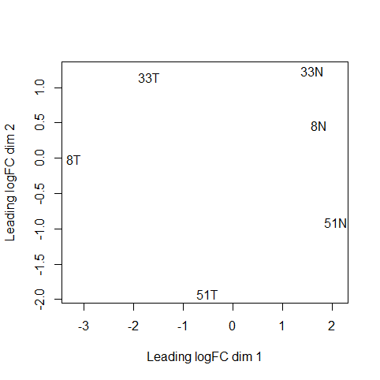
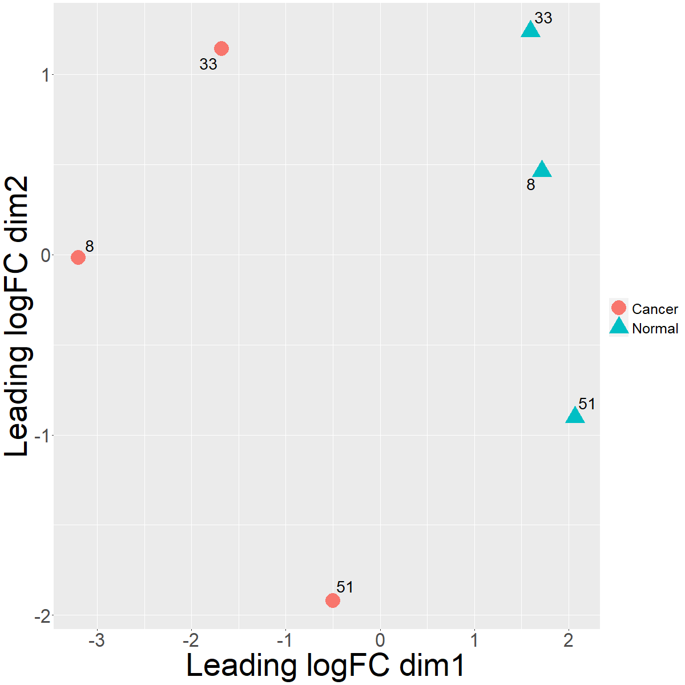
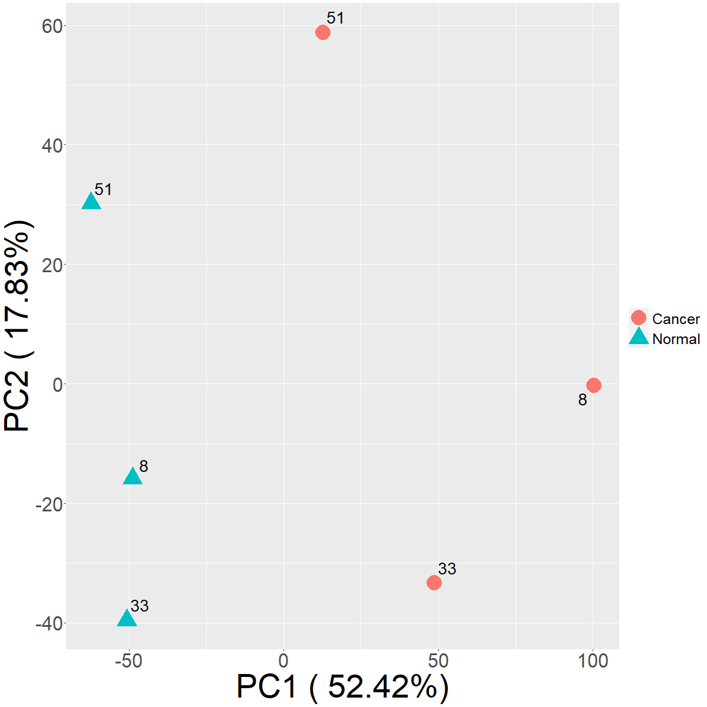
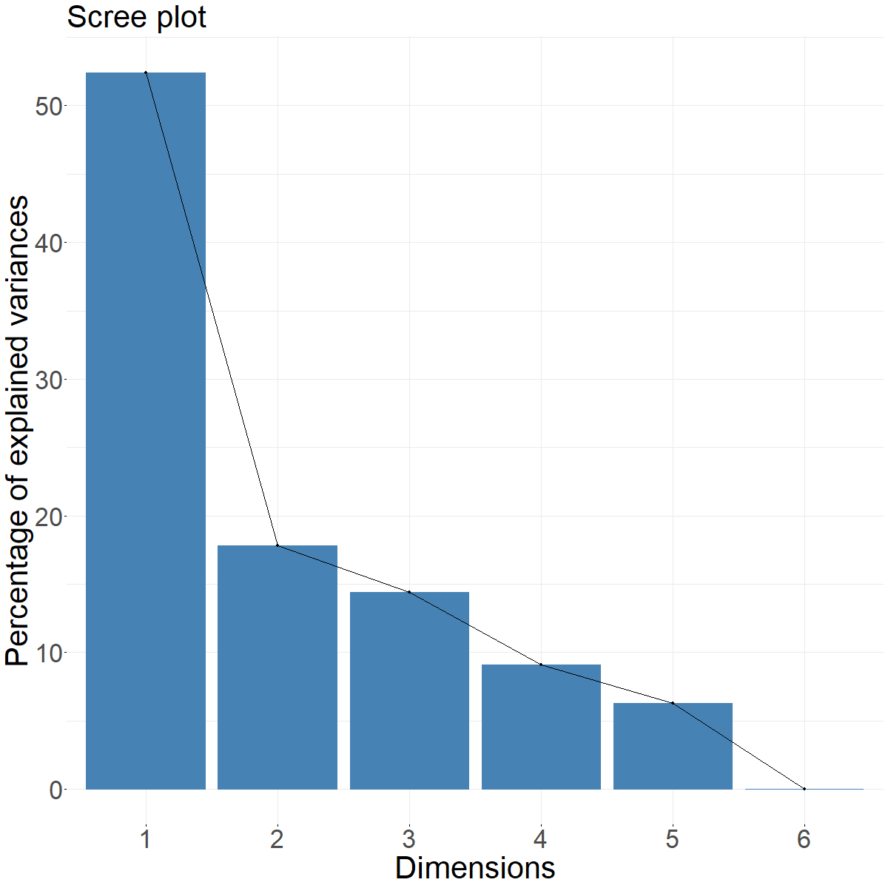

# Clustering samples with a PCoA and PCA using edgeR, prcomp, and ggplot

Oftentimes, we'll need to create an aesthetically pleasing plot that will cluster samples based on a certain criteria (e.g. correlation). 

This tutorial will explain how to take the values obtained from a PCoA (principal coordinate analysis) and PCA (principal component analysis) and plot in ggplot2. The PCoA is using the [edgeR](https://bioconductor.org/packages/release/bioc/html/edgeR.html) package (plotMDS function) and the PCA is using the prcomp function.

In other words, how to convert something like this:



to something like this:



and this:



with the PCA associated scree:




## Brief discussion of PCoA and PCA

A PCA is a subset of PCoA. [Statquest](https://www.youtube.com/user/joshstarmer) has some good videos on [PCoA](https://www.youtube.com/watch?v=FgakZw6K1QQ) and [PCA](https://www.youtube.com/watch?v=HMOI_lkzW08) that discuss differences if you have a few minutes. 

For the purposes of this tutorial, we'll be going over a PCoA that uses leading log fold change (as described in the edgeR documentation) to cluster as well as using the prcomp() function in R to derive the PCA values. One benefit of using a *PCA* is that it is familiar to many *and* displays the percent of variance on each axis (i.e. whether or not there is a substantial amount of variance being shown in the analysis). An advantage of using a *leading log fold change PCoA* is that it specifically uses a metric that has bearing on RNA-seq (i.e. log fold change) to cluster samples. You and your reviewers will need to determine which best suits your purposes.

## Running from files in the repository

To run, download the [clustering.r](https://github.com/patmendoza330/clustering/blob/main/clustering.r) and the [supporting.files](https://github.com/patmendoza330/clustering/tree/main/supporting.files) folder.  

## Data source

Data is sourced from Touch et al., 2010. The original data, [pone.0009317.s009.xls](supporting.files/pone.0009317.s009.xls), has been modified with some columns deleted and headers modified into [TableS1.txt](supporting.files/TableS1.txt). TableS1 will be taken through the RNA-seq steps stated in the user guide through normalization, then we will pick up with clustering samples. 

The data used in the file has three paired replicates from normal and cancerous cells. Patients have numbers associated and cancer vs non-cancer are denoted as "N" or "T"

## Loading libraries

We'll need the following libraries:
```
library(dplyr) 
library(tidyr) 
library(edgeR) 
library(org.Hs.eg.db) 
library(ggplot2) 
library(ggrepel) 
library(factoextra) 
```
`dplyr` and `tidyr` will be used to wrangle and manipulate data. `EdgeR` and the `org.Hs.eg.db` will be used in the differential expression analysis. `ggplot2` and `ggrepel` will be used in the plotting. And finally, `factoextra` is used to assist in plotting the scree plot associated with the PCA. 

## Extracting and preparing data

Download the modified text file [TableS1.txt](supporting.files/TableS1.txt) and run the following code as stated in the user guide:

```
rawdata <- read.delim("TableS1.txt", check.names=FALSE, stringsAsFactors=FALSE)

y <- DGEList(counts=rawdata[,4:9], genes=rawdata[,1:3])

idfound <- y$genes$RefSeqID %in% mappedRkeys(org.Hs.egREFSEQ)
y <- y[idfound,]
dim(y)

egREFSEQ <- toTable(org.Hs.egREFSEQ)

m <- match(y$genes$RefSeqID, egREFSEQ$accession)
y$genes$EntrezGene <- egREFSEQ$gene_id[m]

egSYMBOL <- toTable(org.Hs.egSYMBOL)

m <- match(y$genes$EntrezGene, egSYMBOL$gene_id)
y$genes$Symbol <- egSYMBOL$symbol[m]

o <- order(rowSums(y$counts), decreasing=TRUE)
y <- y[o,]
d <- duplicated(y$genes$Symbol)
y <- y[!d,]

y$samples$lib.size <- colSums(y$counts)

rownames(y$counts) <- rownames(y$genes) <- y$genes$EntrezGene
y$genes$EntrezGene <- NULL

y <- calcNormFactors(y)
``` 

This will allow us to use the values stored with the `y` DGE object to obtain values to carry out our clustering analysis. The objects included in the variable `y` are:

`$counts`
|       |     8N|     8T|    33N|    33T|     51N|    51T|
|:------|------:|------:|------:|------:|-------:|------:|
|378938 | 306305| 330105| 473438| 309917|  712348| 633871|
|7273   | 328503|   1204| 206612|   3178| 1675945| 191624|
|692227 |  62098|  73284| 581364| 365430|  205994| 106640|
|9301   |  56374|  56594| 554127| 260275|  229356| 135146|
|9302   |  95410| 181223| 394803| 209376|  249091| 131438|
|3860   | 393801|   2291| 359693| 106059|  211919|   1833|

`$samples`
|    |group | lib.size| norm.factors|
|:---|:-----|--------:|------------:|
|8N  |1     |  7989764|    1.1460730|
|8T  |1     |  7371254|    1.0856610|
|33N |1     | 15754939|    0.6722509|
|33T |1     | 14043679|    0.9734399|
|51N |1     | 21540962|    1.0318178|
|51T |1     | 15193529|    1.1902823|


 and `$genes`
|       |RefSeqID  |Symbol   | NbrOfExons|
|:------|:---------|:--------|----------:|
|378938 |NR_002819 |MALAT1   |          1|
|7273   |NM_133378 |TTN      |        312|
|692227 |NR_004380 |SNORD104 |          1|
|9301   |NR_002563 |SNORD27  |          1|
|9302   |NR_002564 |SNORD26  |          1|
|3860   |NM_153490 |KRT13    |          8|

To store the data from the PCoA we run the following code:
```
pcoa.data <- plotMDS(y)
```
The third element of this list has the x and y coordinates of our PCoA:
```
pcoa.data <- pcoa.data[[3]]
pcoa.data
```
|    |      [, 1]|[, 2]      |
|:---|----------:|----------:|
|8N  |  1.7182412|  0.4621997|
|8T  | -3.2008003| -0.0182245|
|33N |  1.5966992|  1.2367198|
|33T | -1.6819569|  1.1428929|
|51N |  2.0690535| -0.9026850|
|51T | -0.5012367| -1.9209030|

To obtain the values for a PCA, we'll be using the `prcomp` function in R which needs data in a slightly different format than the edgeR package:

```
pca.counts <- cpm(y, log = TRUE)
pca.counts <- pca.counts %>%
  t()
pca <- prcomp(pca.counts)
```

First we obtain the log transformed CPM from our DGE, then we transpose the format so that prcomp can be used. We'll be using the first two principal components which are stored in the `$x` value:

```
pca.data <- pca$x
pca.data
```

|    |       PC1|         PC2|        PC3|         PC4|        PC5| PC6|
|:---|---------:|-----------:|----------:|-----------:|----------:|---:|
|8N  | -48.86463| -15.8492751|  21.105142|   0.4908541| -39.630495|   0|
|8T  | 100.38566|  -0.2757508|  44.382504|   6.8529166|   6.395682|   0|
|33N | -50.69910| -39.5646579|  -6.355969|  32.9981898|  22.652827|   0|
|33T |  48.70084| -33.3002506| -44.541605| -29.3624596|  -2.308737|   0|
|51N | -62.27228|  30.1980006|  18.542396| -34.3765335|  19.754249|   0|
|51T |  12.74951|  58.7919338| -33.132469|  23.3970326|  -6.863526|   0|

## Data manipulation

Starting with the PCoA, we now have coordinates for each of the replicates that can be plotted, but we need to have additional grouping information so that our plot can have all of the information that makes it easy to understand. That means adding columns for the patient and the type of cell that is being analyzed (cancer vs normal)

Lets give column names to the dataset and then split the first column so that we can designate those as additional fields in the table.

```
colnames(pcoa.data) <- c("x", "y")
pcoa.data <- as.data.frame(pcoa.data)
pcoa.data <- tibble::rownames_to_column(pcoa.data, "patient.cell")
pcoa.data <- pcoa.data %>%
  separate(col = "patient.cell", into = c('patient', 'cell'), sep = -1) %>%
  mutate(cell.de = case_when(cell =="N" ~ "Normal", 
                               cell == "T" ~ "Cancer"))
pcoa.data
```

|patient |cell |          x|          y|cell.de |
|:-------|:----|----------:|----------:|:-------|
|8       |N    |  1.7182412|  0.4621997|Normal  |
|8       |T    | -3.2008003| -0.0182245|Cancer  |
|33      |N    |  1.5966992|  1.2367198|Normal  |
|33      |T    | -1.6819569|  1.1428929|Cancer  |
|51      |N    |  2.0690535| -0.9026850|Normal  |
|51      |T    | -0.5012367| -1.9209030|Cancer  |

Now we want to do the same with the PCA data:

```
pca.data <- as.data.frame(pca.data)
pca.data <- tibble::rownames_to_column(pca.data, "patient.cell")
pca.data <- pca.data %>%
  separate(col = "patient.cell", into = c('patient', 'cell'), sep = -1) %>%
  mutate(cell.de = case_when(cell =="N" ~ "Normal", 
                             cell == "T" ~ "Cancer"))
pca.data
```
|patient |cell |       PC1|         PC2|        PC3|         PC4|        PC5| PC6|cell.de |
|:-------|:----|---------:|-----------:|----------:|-----------:|----------:|---:|:-------|
|8       |N    | -48.86463| -15.8492751|  21.105142|   0.4908541| -39.630495|   0|Normal  |
|8       |T    | 100.38566|  -0.2757508|  44.382504|   6.8529166|   6.395682|   0|Cancer  |
|33      |N    | -50.69910| -39.5646579|  -6.355969|  32.9981898|  22.652827|   0|Normal  |
|33      |T    |  48.70084| -33.3002506| -44.541605| -29.3624596|  -2.308737|   0|Cancer  |
|51      |N    | -62.27228|  30.1980006|  18.542396| -34.3765335|  19.754249|   0|Normal  |
|51      |T    |  12.74951|  58.7919338| -33.132469|  23.3970326|  -6.863526|   0|Cancer  |

Additionally, we need to have labels for our PCA which show how much of the variance is described by each of the principal components. This is accomplished with the following code:

```
percentage <- round(pca$sdev^2 / sum(pca$sdev^2) * 100, 2)
percentage <- paste(colnames(pca$x), "(", 
                    paste(as.character(percentage), "%", ")", sep="") )
percentage
```
[1] "PC1 ( 52.42%)" "PC2 ( 17.83%)" "PC3 ( 14.37%)" "PC4 ( 9.11%)" 

[5] "PC5 ( 6.27%)"  "PC6 ( 0%)"  

Now that we're done with that, lets move onto plotting!
## Plotting 

*Please note:* the size of the font has been optimized for a 1200x1200 plot. If you are running this in RStudio, be sure to adjust the export size, otherwise, text will appear abnormally large in the preview window.

### PCoA
```
p <- ggplot(pcoa.data, aes(x = x, y = y, colour = cell.de)) +
  geom_point(aes(shape=cell.de, color=cell.de), size = 12) + 
  geom_text_repel(aes(label = patient), size=10, 
                  max.overlaps = Inf, show.legend = FALSE, 
                  colour = "black", point.padding = 20) + 
  xlab("Leading logFC dim1") + 
  ylab("Leading logFC dim2") + 
  theme(plot.title = element_text(size = rel(6), hjust = 0.5), 
        axis.title = element_text(size = rel(5)), 
        axis.text = element_text(size = rel(3)), 
        legend.key.size = unit(1, 'cm'), legend.key.height = unit(1, 'cm'), 
        legend.key.width = unit(1, 'cm'), 
        legend.title = element_blank(),
        legend.text = element_text(size=25))
```


### PCA

```
p <- ggplot(pca.data, aes(x = PC1, y = PC2, colour = cell.de)) +
  geom_point(aes(shape=cell.de, color=cell.de), size = 12) + 
  geom_text_repel(aes(label = patient), size=10, max.overlaps = Inf, 
                  show.legend = FALSE, colour = "black", 
                  point.padding = 20) + 
  xlab(percentage[1]) + 
  ylab(percentage[2]) + 
  theme(plot.title = element_text(size = rel(6), hjust = 0.5), 
        axis.title = element_text(size = rel(5)), 
        axis.text = element_text(size = rel(3)), 
        legend.key.size = unit(1, 'cm'), legend.key.height = unit(1, 'cm'),
        legend.key.width = unit(1, 'cm'),
        legend.title = element_blank(), 
        legend.text = element_text(size=25)) 
```

and this:


Scree plot

```
p <- fviz_eig(pca) + 
  theme(text=element_text(size=35), axis.title = element_text(size=42), 
        axis.text = element_text(size=35))
```


## Final Notes

Now, this covers a fairly simple case where we have only two groups, but if you have more than two groups or want to distinguish between the patients (in this example), you can also use different [shapes](http://www.sthda.com/english/wiki/ggplot2-point-shapes) using the shapes aesthetic. For example, you may want to distinguish between treatments by having a shape that is either empty or filled.

## Citation

[Tuch, B. B., et al. (2010). "Tumor Transcriptome Sequencing Reveals Allelic Expression Imbalances Associated with Copy Number Alterations." PloS one **5**(2): e9317.](https://journals.plos.org/plosone/article?id=10.1371/journal.pone.0009317)